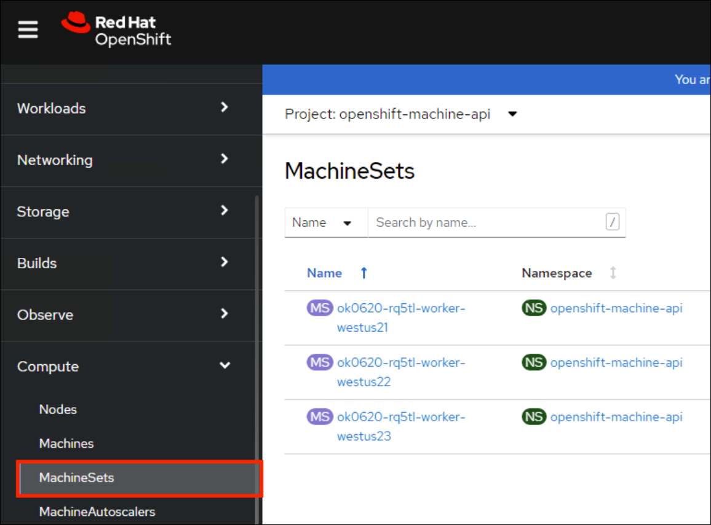

## Task 10: Azure Service Operator - Blob Store

### Integrating with Azure services

So far, our OSToy application has functioned independently without relying on any external services. While this may be nice for a workshop environment, it’s not exactly representative of real-world applications. Many applications require external services like databases, object stores, or messaging services.

In this section, we will learn how to integrate our OSToy application with other Azure services, specifically Azure Blob Storage and Key Vault. By the end of this section, our application will be able to securely create and read objects from Blob Storage.

To achieve this, we will use the Azure Service Operator (ASO) to create the necessary services for our application directly from Kubernetes. We will also utilize Key Vault to securely store the connection secret required for accessing the Blob Storage container. We will create a Kubernetes secret to retrieve this secret from Key Vault, enabling our application to access the Blob Storage container using the secret.

To demonstrate this integration, we will use OSToy to create a basic text file and save it in Blob Storage. Finally, we will confirm that the file was successfully added and can be read from Blob Storage.

#### Azure Service Operator (ASO)

The [Azure Service Operator](https://azure.github.io/azure-service-operator/) (ASO) allows you to create and use Azure services directly from Kubernetes. You can deploy your applications, including any required Azure services directly within the Kubernetes framework using a familiar structure to declaratively define and create Azure services like Storage Blob or CosmosDB databases.

#### Key Vault

Azure Key Vault is a cloud-based service provided by Microsoft Azure that allows you to securely store and manage cryptographic keys, secrets, and certificates used by your applications and services.

##### Why should you use Key Vault to store secrets?

Using a secret store like Azure Key Vault allows you to take advantage of a number of benefits.

1. Scalability - Using a secret store service is already designed to scale to handle a large number of secrets over placing them directly in the cluster.
1. Centralization - You are able to keep all your organizations secrets in one location.
1. Security - Features like access control, monitoring, encryption and audit are already baked in.
1. Rotation - Decoupling the secret from your cluster makes it much easier to rotate secrets since you only have to update it in Key Vault and the Kubernetes secret in the cluster will reference that external secret store. This also allows for separation of duties as someone else can manage these resources.

#### Section overview

To provide a clearer understanding of the process, the procedure we will be following consists of three primary parts.

1. **Install the Azure Service Operator** - This allows you to create/delete Azure services (in our case, Blob Storage) through the use of a Kubernetes Custom Resource. Install the controller which will also create the required namespace and the service account and then create the required resources.
1. **Setup Key Vault** - Perform required prerequisites (ex: install CSI drivers), create a Key Vault instance, add the connection string.
1. **Application access** - Configuring the application to access the stored connection string in Key Vault and thus enable the application to access the Blob Storage location.

Below is an updated application diagram of what this will look like after completing this section.


**Access the cluster** - Login to the cluster using the oc CLI if you are not already logged in.

#### Setup

##### Define helper variables

Set helper environment variables to facilitate execution of the commands in this section. Replace <REGION> with the Azure region you are deploying into (ex: eastus or westus2).

Replace the **{Application Id}** for SERVICE_PRINCIPAL_CLIENT_ID and **{Secret Key}** for SERVICE_PRINCIPAL_CLIENT_SECRET with the actual values by navigating to the **Environment > Service Principal Details** tab in your lab environment.


```
export AZURE_SUBSCRIPTION_ID=<inject key="Subscription ID" enableCopy="false"/>
export AZ_TENANT_ID=<inject key="Tenant ID" enableCopy="false"/>
export PROJECT_NAME=ostoy-app01
export KEYVAULT_NAME=keyvault<inject key="Deployment ID" enableCopy="false"/>
export REGION=<inject key="Region" enableCopy="false"/>
export SERVICE_PRINCIPAL_CLIENT_ID={Application Id}
export SERVICE_PRINCIPAL_CLIENT_SECRET={Secret Key}
```

##### Install Helm

1. Install Helm if you don’t already have it by running the below commands in the Azure cloudshell. You can also check the [Official Helm site](https://helm.sh/docs/intro/install/) for other install options.

   ```
   curl -LO https://get.helm.sh/helm-v3.15.4-linux-amd64.tar.gz
   tar -zxvf helm-v3.15.4-linux-amd64.tar.gz
   ```

1. Verify the Helm version installed.

   ```
   helm version
   ```
   
##### Install the Azure Service Operator - Set up ASO

1. We first need to install Cert Manager. Run the following.

   ```
   oc apply -f https://github.com/jetstack/cert-manager/releases/download/v1.8.2/cert-manager.yaml
   ```

1. Confirm that the cert-manager pods have started successfully before continuing.

   ```
   oc get pods -n cert-manager
   ```

1. You will see a response like:

   ```
   NAME                                       READY   STATUS    RESTARTS   AGE
   cert-manager-677874db78-t6wgn              1/1     Running   0          1m
   cert-manager-cainjector-6c5bf7b759-l722b   1/1     Running   0          1m
   cert-manager-webhook-5685fdbc4b-rlbhz      1/1     Running   0          1m
   ```

1. We then need to add the latest Helm chart for the ASO.

   ```
   helm repo add aso2 https://raw.githubusercontent.com/Azure/azure-service-operator/main/v2/charts
   ```

1. Update the Helm repository.

   ```
   helm repo update
   ```

1. Install the ASO.

   ```
   helm upgrade --install aso2 aso2/azure-service-operator \
    --create-namespace \
    --namespace=azureserviceoperator-system \
    --set crdPattern='resources.azure.com/*;containerservice.azure.com/*;keyvault.azure.com/*;managedidentity.azure.com/*;eventhub.azure.com/*'
   ```

1. Ensure that the pods are running successfully. This could take about 2 minutes.

   ```
   oc get pods -n azureserviceoperator-system
   ```

1. You will see a response like:

   ```
   NAME                                                      READY   STATUS    RESTARTS   AGE
   azureserviceoperator-controller-manager-5b4bfc59df-lfpqf   2/2     Running   0          24s
   ```

### Create Storage Accounts and containers using Azure portal

Now we need to create a Storage Account for our Blob Storage, to use with OSToy.

1. First, create a new OpenShift project for our OSToy app (even if you already have one from earlier).

   ```
   oc new-project $PROJECT_NAME
   ```

1. Navigate to Azure portal and select **Resource groups**.

   

1. On the **Create a resource group** tab, specify the following settings and click **Review + create** and **Create**.

   - Subscription: Select your default subscription
   - Resource group: **ostoy-app01-rg**
   - Region: **<inject key="Region" enableCopy="false"/>**
  
      

1. In the search bar, search for storage and select **Storage accounts** and **Create** a new storage account.

   

1. On the **Create a storage account** tab, specify the following settings and click **Next**.

   - Resource group: **ostoy-app01-rg**
   - Storage account name: **ostoystorage<inject key="Deployment ID" enableCopy="false"/>**
   - Region: **<inject key="Region" enableCopy="false"/>**
   - Primary service: **Azure Blob Storage or Azure Data Lake Storage Gen 2**
   - Performance: **Standard**
   - Redundancy: **Locally-redundant storage (LRS)**
  
1. On the **Advanced** tab, enable the **Allow enabling anonymous access on individual containers** and click **Review + create** and then **Create**.

   

1. Once the storage account deployment succeeds, click **Go to resource**.

   

1. In the newly created storage account, navigate to **Data storage > Containers** settings and click **+ Container** to create new storage containers.

   

1. Specify the new container name as **ostoystorage<inject key="Deployment ID" enableCopy="false"/>service**, select **Blob (anonymous read access for blobs only)** from the dropdown menu and click **Create**.

   

1. Create another container by specifying the container name as **ostoy-app01-container**, select **Container (anonymous read access for containers and blobs)** from the dropdown menu and click **Create**.

   

1. In the storage account, navigate to **Security + Networking > Shared access signature**, enable all the permissions and click **Generate SAS and connection string** to create a new connection string and copy the **Connection string** value in a notepad. You will need this connection string value in the next tasks.

   

   

1. The storage account is now set up for use with our application.

### Install Kubernetes Secret Store CSI

In this part we will create a Key Vault location to store the connection string to our Storage account. Our application will use this to connect to the Blob Storage container we created, enabling it to display the contents, create new files, as well as display the contents of the files. We will mount this as a secret in a secure volume mount within our application. Our application will then read that to access the Blob storage.

1. To simplify the process for the workshop, a script is provided that will do the prerequisite work in order to use Key Vault stored secrets, run the below command in **CloudShell**. If you are curious, please feel free to read the script, otherwise just run it. This should take about 1-2 minutes to complete.

   ```
   curl https://raw.githubusercontent.com/microsoft/aroworkshop/master/resources/setup-csi.sh | bash
   ```
   Or, if you’d rather not live on the edge, feel free to download it first.

   >**NOTE:** This command might take more than expected time to execute completely. In this case, open cloudshell window in another browser/tab, login to the OpenShift console by running the **oc login** command and define the variables again under **Define helper variables** section of this task to proceed with the next steps.

   >**NOTE:** Instead, you could connect your cluster to Azure ARC and use the [KeyVault extension](https://learn.microsoft.com/en-us/azure/azure-arc/kubernetes/tutorial-akv-secrets-provider)

1. In the search bar, search for key vaults and select **Key vaults** and **Create** a new key vault.

   

1. On the **Create a key vault** tab, specify the following settings and click **Next**.

   - Resource group: **ostoy-app01-rg**
   - Key vault name: **keyvault<inject key="Deployment ID" enableCopy="false"/>**
   - Region: **<inject key="Region" enableCopy="false"/>**
   - Pricing tier: **Standard**
  
   
  
1. On the **Access configuration** tab, select **Vault access policy** as Permission model and click **+ Create** under Access policies.

   

1. On the **Create an access policy > Permissions** tab, select all the permissions for **Secret permissions** and click **Next**.

   

1. On the **Principal** tab, search for the service principal **https://odl_user_sp_<inject key="Deployment ID" enableCopy="false"/>**, select it and click **Next**.

   

1. On the **Review + create** tab, review the access policy settings and click **Create**.

   

1. Back on Create a key vault page, click on **Review + create** > **Create**.

1. Now that the access policies are set up, create the key vault. Once the key vault deployment succeeds, click **Go to resource**.

   

1. In the newly created key vault, navigate to **Objects > Secrets** settings and click **+ Generate/Import** to create a new secret.

   

1. On the **Create a secret** tab, specify the name as **connectionsecret**, paste the storage account connection string from the previous task and click **Create**.

   

1. Create a secret for Kubernetes to use to access the Key Vault. When this command is executed, the Service Principal’s credentials are stored in the **secrets-store-creds** Secret object, where it can be used by the Secret Store CSI driver to authenticate with Azure Key Vault and retrieve secrets when needed.

   ```
   oc create secret generic secrets-store-creds -n $PROJECT_NAME --from-literal clientid=$SERVICE_PRINCIPAL_CLIENT_ID --from-literal clientsecret=$SERVICE_PRINCIPAL_CLIENT_SECRET
   ```

1. Create a label for the secret. By default, the secret store provider has filtered watch enabled on secrets. You can allow it to find the secret in the default configuration by adding this label to the secret.

   ```
   oc -n $PROJECT_NAME label secret secrets-store-creds secrets-store.csi.k8s.io/used=true
   ```

1. Create the Secret Provider Class to give access to this secret. To learn more about the fields in this class see [Secret Provider Class](https://learn.microsoft.com/en-us/azure/aks/hybrid/secrets-store-csi-driver#create-and-apply-your-own-secretproviderclass-object) object.

   ```
   cat <<EOF | oc apply -f -
   apiVersion: secrets-store.csi.x-k8s.io/v1
   kind: SecretProviderClass
   metadata:
     name: azure-kvname
     namespace: $PROJECT_NAME
   spec:
     provider: azure
     parameters:
       usePodIdentity: "false"
       useVMManagedIdentity: "false"
       userAssignedIdentityID: ""
       keyvaultName: "${KEYVAULT_NAME}"
       objects: |
         array:
           - |
             objectName: connectionsecret
             objectType: secret
             objectVersion: ""
       tenantId: "${AZ_TENANT_ID}"
   EOF
   ```

<validation step="58614025-40b6-49fa-ac36-a00931c3dae0" />

### Create a custom Security Context Constraint (SCC)

SCCs are outside the scope of this workshop. Though, in short, OpenShift SCCs are a mechanism for controlling the actions and resources that a pod or container can access in an OpenShift cluster. SCCs can be used to enforce security policies at the pod or container level, which helps to improve the overall security of an OpenShift cluster. For more details please see [Managing security context constraints](https://docs.openshift.com/container-platform/4.16/authentication/managing-security-context-constraints.html).

1. Create a new SCC that will allow our OSToy app to use the Secrets Store Provider CSI driver. The SCC that is used by default, **restricted**, does not allow it. So in this custom SCC we are explicitly allowing access to CSI. If you are curious feel free to view the file first, the last line in specific.

   ```
   oc apply -f https://raw.githubusercontent.com/microsoft/aroworkshop/master/yaml/ostoyscc.yaml
   ```

1. Create a Service Account for the application.

   ```
   oc create sa ostoy-sa -n $PROJECT_NAME
   ```

1. Grant permissions to the Service Account using the custom SCC we just created.

   ```
   oc adm policy add-scc-to-user ostoyscc system:serviceaccount:${PROJECT_NAME}:ostoy-sa
   ```

#### Deploy the OSToy application

1. Deploy the application. First deploy the microservice.

   ```
   oc apply -n $PROJECT_NAME -f https://raw.githubusercontent.com/microsoft/aroworkshop/master/yaml/ostoy-microservice-deployment.yaml
   ```

1. Run the following to deploy the frontend. This will automatically remove the comment symbols for the new lines that we need in order to use the secret.

   ```
   curl https://raw.githubusercontent.com/CloudLabsAI-Azure/aroworkshop/master/yaml/ostoy-frontend-deployment.yaml | oc apply -n $PROJECT_NAME -f -
   ```

   >**Note:** To view the YAML file with comments https://raw.githubusercontent.com/openshift-cs/rosaworkshop/master/rosa-workshop/ostoy/yaml/ostoy-frontend-deployment.yaml

### See the storage contents through OSToy - READ-ONLY

After about a minute we can use our app to see the contents of our Blob storage container.

1. Get the route for the newly deployed application.

   ```
   oc get route ostoy-route -n $PROJECT_NAME -o jsonpath='{.spec.host}{"\n"}'
   ```

1. Open a new browser tab and enter the route from above. Ensure that it is using **http://** and not **https://**.

1. A new menu item will appear. Click on “ASO - Blob Storage” in the left menu in OSToy.

1. You will see a page that lists the contents of the bucket, which at this point should be empty.

   

1. Move on to the next step to add some files.

### Create files in your Azure Blob Storage Container - READ-ONLY

For this step we will use OStoy to create a file and upload it to the Blob Storage Container. While Blob Storage can accept any kind of file, for this workshop we’ll use text files so that the contents can easily be rendered in the browser.

1. Click on “ASO - Blob Storage” in the left menu in OSToy.

1. Scroll down to the section underneath the “Existing files” section, titled “Upload a text file to Blob Storage”.

1. Enter a file name for your file.

1. Enter some content for your file.

1. Click “Create file”.

   

1. Scroll up to the top section for existing files and you should see your file that you just created there.

1. Click on the file name to view the file.

   

1. Now to confirm that this is not just some smoke and mirrors, let’s confirm directly via the CLI. Run the following to list the contents of our bucket.

   ```
   az storage blob list --account-name ostoystorage${MY_UUID} --connection-string $CONNECTION_STRING -c ${PROJECT_NAME}-container --query "[].name" -o tsv
   ```

   We should see our file(s) returned.


### Adding node labels

To add a node label it is recommended to set the label in the machine set. While you can directly add a label the node, this is not recommended since nodes could be overwritten and then the label would disappear. Once the machine set is modified to contain the desired label any new machines created from that set would have the newly added labels. This means that existing machines (nodes) will not get the label. Therefore, to make sure all nodes have the label, you should scale the machine set down to zero and then scale the machine set back up.

##### Using the web console

1. Select “MachineSets” from the left menu. You will see the list of machinesets.

   

1. We’ll select the first one “ok0620-rq5tl-worker-westus21”

1. Click on the second tab “YAML”

1. Click into the YAML and under spec.template.spec.metadata add “labels:” then under that add a key:value pair for the label you want. In our example we can add a label “tier: frontend”. Click Save.

   

1. The already existing machine won’t get this label but any new machines will. So to ensure that all machines get the label, we will scale down this machine set to zero, then once completed we will scale it back up as we did earlier.

1. Click on the node that was just created.

1. You can see that the label is now there.

   

