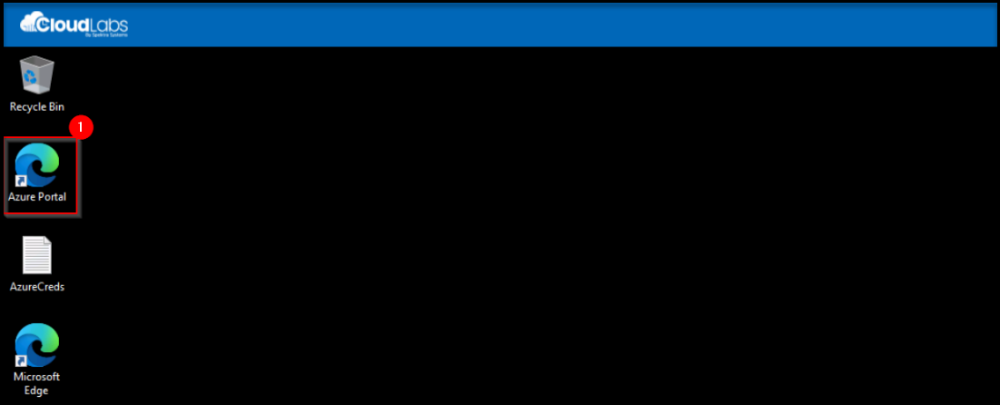

# Azure Red Hat OpenShift Workshop

### Overall Estimated Duration: 4 hours

## Overview

Azure Red Hat OpenShift is a fully managed Red Hat OpenShift service in Azure that is jointly engineered and supported by Microsoft and Red Hat. In this lab, you'll go through a set of tasks that will help you understand some of the concepts of deploying and securing container based applications on top of Azure Red Hat OpenShift.

## Objective

This lab is designed to equip participants with hands-on experience in insights on Azure Red Hat OpenShift Cluster. By completing this lab, participants will learn to:

- **Go Microservices:** Deploy a containerized Go-based microservices application on Azure Red Hat OpenShift (ARO) using MongoDB for persistent storage.
- **Build a Java Application with a PostgreSQL Azure DB:** Develop and deploy a Java application on ARO that connects to Azure Database for PostgreSQL, utilizing Source-to-Image (S2I) for containerization.
- **Azure Front Door Integration with Azure Red Hat OpenShift (ARO):** Configure Azure Front Door to securely expose and load-balance applications hosted on ARO, ensuring high availability and performance.

You'll be doing the majority of the labs using the OpenShift CLI, but you can also accomplish them using the Azure Red Hat OpenShift web console.

## Prerequisites

Participants should have:

- **Basic Knowledge of Cloud Computing:** Understanding fundamental cloud concepts, especially related to Azure, will be beneficial.
- **Familiarity with OpenShift:** A basic grasp of what OpenShift is and how it operates can help, though detailed experience is not always required.
- **Experience with Linux Command Line:** Since OpenShift runs on Linux-based containers, knowing how to use the command line in a Linux environment is useful.
- **Understanding of Containers and Kubernetes:** Familiarity with containerization concepts and Kubernetes basics is important as OpenShift is built on Kubernetes.
- **Basic Programming or Scripting Skills:** Basic scripting skills (e.g., Bash, PowerShell) can be helpful for automating tasks and interacting with the environment.
- **Azure Portal Navigation:** Comfort with navigating the Azure Portal, as well as understanding basic Azure services, will help participants manage and deploy resources effectively.

## Architecture

This lab manifests integrating ARO with several Azure services such as Azure Front Door + WAF for securely handling ingress traffic, Firewall for inspecting egress traffic to avoid data exfiltration, and Azure Active Directory for Role Based Access Control and so on.  Also, provides several recommended best practices for ARO deployment, from Networking best practices that supports multi-region growth, on-boarding the cluster on to Arc and enabling Container Insights to monitor the cluster and workload.

## Azure Red Hat OpenShift Architecture

### Architecture Diagram - Lab 1 - Go Microservices

### Architecture Diagram - Lab 2 - Build a Java Application with a PostgreSQL Azure DB

### Architecture Diagram - Lab 3 - Azure Front Door Integration with Azure Red Hat OpenShift (ARO)

## Explanation of Components

The architecture for this lab involves several key components:

- **Azure Red Hat OpenShift:** A fully managed OpenShift service on Azure, providing a platform to deploy, manage, and scale containerized applications.
- **Azure Virtual Network (VNet):** Creates isolated and secure network environments for communication between Azure resources.
- **Azure Storage Account:** Provides scalable storage solutions for various types of data, such as blobs, files, and queues, which applications running in OpenShift can use.
- **Azure Key Vault:** Protects sensitive information like secrets, keys, and certificates used by applications and services.
- **MongoDB Atlas:** A cloud-based database service providing a managed MongoDB environment, which can be integrated with OpenShift applications for data storage and management.
- **Azure Load Balancer:** Distributes incoming network traffic across multiple servers to ensure high availability and reliability of applications running in the OpenShift cluster.
- **Master Nodes:** The control plane components in the ARO cluster responsible for managing and orchestrating the worker nodes and overall cluster state.
- **Worker Nodes:** The compute resources in the ARO cluster that run application containers and provide the processing power required for the workloads.
- **Azure PostgreSQL Flexible Server:** Provides a managed, scalable PostgreSQL database backend for the Java application deployed on Azure Red Hat OpenShift.
- **Azure Front Door:** Acts as a global, secure entry point that routes and load-balances external traffic to the frontend application running on Azure Red Hat OpenShift.

## Getting Started with Your Lab Environment
 
Welcome to your Azure Red Hat OpenShift Workshop! We've prepared a seamless environment for you to explore and learn about Azure services. Let's begin by making the most of this experience.
 
## Accessing Your Lab Environment
 
Once you're ready to dive in, your virtual machine and lab guide will be right at your fingertips within your web browser.

  

### Virtual Machine & Lab Guide
 
 Your virtual machine is your main tool throughout the workshop. The lab guide is your roadmap to success.
 
## Exploring Your Lab Resources
 
To get a better understanding of your lab resources and credentials, navigate to the **Environment** tab.
 
  
 
## Utilizing the Split Window Feature
 
For convenience, you can open the lab guide in a separate window by clicking on the **Split Window** button in the top right corner.
 
  
 
## Managing Your Virtual Machine
 
Feel free to **start, stop, or restart (2)** your virtual machine as needed from the **Resources (1)** tab. Your experience is in your hands!

  

## Lab Guide Zoom In/Zoom Out
 
To adjust the zoom level for the environment page, click the **A↕ : 100%** icon located next to the timer in the lab environment.

  

## Let's Get Started with the Azure Portal
 
1. On your virtual machine, click on the **Azure Portal (1)** icon, as shown below.
 
    

1. On the **Sign in to Microsoft Azure** tab, you will see the login screen. In that, enter the following and click on **Next**. 

   * **Email/Username**: <inject key="AzureAdUserEmail"></inject>
   
      
     
1. Next, enter the **password** and click on **Sign in**.
   
   * **Password**: <inject key="AzureAdUserPassword"></inject>
   
      

1. If you see the pop-up **Action Required**, click on **Ask Later**.

   
     
1. Select **No,** if you see the pop-up, **Stay Signed in.**

1. If you see the pop-up, **You have free Azure Advisor recommendations!** Close the window to continue the lab.

1. If a **Welcome to Microsoft Azure** pop-up window appears, select **Cancel** to skip the tour.

## Support Contact
 
The CloudLabs support team is available 24/7, 365 days a year, via email and live chat to ensure seamless assistance at any time. We offer dedicated support channels tailored specifically for both learners and instructors, ensuring that all your needs are promptly and efficiently addressed.

Learner Support Contacts:
- Email Support: cloudlabs-support@spektrasystems.com
- Live Chat Support: https://cloudlabs.ai/labs-support

Now, click on **Next** from the lower right corner to move on to the next page.

### Happy Learning!
