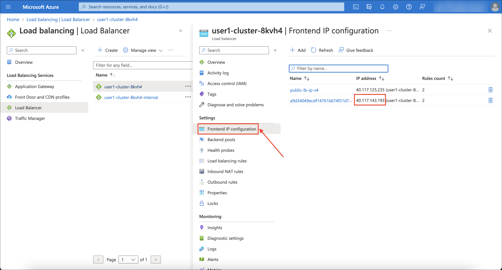

# Lab 2 - Build a Java Application with a PostgreSQL Azure DB

### Estimated Duration: 60 minutes

It's time for us to put our cluster to work and deploy a workload. In this lab, you're going to build an example Java application, [microsweeper](https://github.com/redhat-mw-demos/microsweeper-quarkus/tree/ARO), using [Quarkus](https://quarkus.io/) (a Kubernetes Native Java stack) and [Azure Database for PostgreSQL](https://azure.microsoft.com/en-us/products/postgresql/) and then connect to your Azure Red Hat OpenShift cluster.

## Lab Objectives

You will be able to complete the following tasks:

- Task 1: Create Azure Database for PostgreSQL instance
- Task 2: Build and deploy the Microsweeper app
- Task 3: Test the Application
- Task 4: Review the runs in console (READ-ONLY)
- Troubleshooting Steps (included for MacOS as well)

## Task 1: Create Azure Database for PostgreSQL instance

In this task, you will create a managed PostgreSQL database instance in Azure to support the Microsweeper app.

1. If not logged in via the CLI, click on the dropdown arrow next to your name in the top-right and select *Copy Login Command*.

   

1. A new tab will open click "Display Token"

1. Copy the command under where it says, "Log in with this token". Then go to your terminal and paste that command and press enter. You will see a similar confirmation message if you successfully logged in.

   ```
   $ oc login --token=sha256~qWBXdQ_X_4wWZor0XZO00ZZXXXXXXXXXXXX --server=https://api.abcs1234.westus.aroapp.io:6443
   Logged into "https://api.abcd1234.westus.aroapp.io:6443" as "kube:admin" using the token provided.

   You have access to 67 projects, the list has been suppressed. You can list all projects with 'oc projects'

   Using project "default".
   ```

1. Create a new namespace (also known as a project in OpenShift). To do so, run the following command:

   ```bash
   oc new-project microsweeper-ex
   ```

1. Navigate to the Azure Red Hat OpenShift console to verify that the new project/namespace is created.

   

1. Define the environment variables.
   
   - Replace the **DEPLOYMENT_ID** value with **<inject key="Deployment ID" enableCopy="false"/>**.
   - Replace the **AZ_LOCATION** value with **<inject key="Region" enableCopy="false"/>**.
  
   >**NOTE:** Navigate to the **Environment** tab to fetch the Deployment ID and Region variables.

   ```
   export UNIQUE="DEPLOYMENT_ID"
   export AZ_LOCATION="RG_REGION"
   ```

1. Create the Azure Postgres Server resource. To do so, run the following command (this command will take ~ 5mins).
     
   > **NOTE:** For the sake of the workshop we are creating a public database that any host in Azure can connect to. In a real world scenario you would create a private database and connect to it over a private link service"

   ```bash
   # Create PostgreSQL Flexible server
   az postgres flexible-server create \
   --resource-group "openshift" \
   --location "${AZ_LOCATION}" \
   --sku-name Standard_D2s_v3 \
   --name "microsweeper-${UNIQUE}" \
   --storage-size 1024 \
   --admin-user myAdmin \
   --admin-pass 'psqlPass@123' \
   --public 0.0.0.0
   ```

   * **Command Parameters**

   | Parameter | Description |
   |-----------|-------------|
   | `--resource-group` | Resource group where the server will be created |
   | `--location` | Azure region where the server will be deployed |
   | `--sku-name` | Server type and capacity (Standard_D2s_v3) |
   | `--name` | PostgreSQL flexible server name in Azure |
   | `--storage-size` | Storage size in MB (1024 = 1 GB) |
   | `--admin-user` | Administrator username for the flexible server |
   | `--admin-pass` | Administrator password |
   | `--public` | Allows connections from public IP addresses (0.0.0.0 = any IP) |

1. Once the server is created, create a firewall rule to allow access from Azure services and a database:

   ```bash
   # Create firewall rule to allow access from Azure services
   az postgres flexible-server firewall-rule create \
     --resource-group "openshift" \
     --name "microsweeper-${UNIQUE}" \
     --rule-name "AllowAllAzureIPs" \
     --start-ip-address 0.0.0.0 \
     --end-ip-address 0.0.0.0
   ```

   ```
   # Create a database
   az postgres flexible-server db create \
     --resource-group "openshift" \
     --server-name "microsweeper-${UNIQUE}" \
     --database-name "myApplication"
   ```

1. Check connectivity from our Cloud Shell to our database. To do so, run the following command:

    ```bash
    psql "host=microsweeper-${UNIQUE}.postgres.database.azure.com \
      port=5432 \
      dbname=myApplication \
      user=myAdmin \
      password=psqlPass@123 \
      sslmode=require" \
      -c "SELECT now();"
    ```

1. Your output should look similar to:

   ```{.text .no-copy}
                 now
   -------------------------------
   2022-11-15 06:39:13.903299+00
   (1 row)
   ```

## Task 2: Build and deploy the Microsweeper app

Now that we've got a PostgreSQL instance up and running, let's build and deploy our application. In this task, you will build the Microsweeper application and deploy it to the Azure Red Hat OpenShift (ARO) environment.

1. First, let's clone the application from GitHub to our local Cloud Shell. To do so, run the following command:

   ```bash
   git clone https://github.com/rh-mobb/aro-workshop-app.git
   ```

1. Next, let's change directory into the newly cloned Git repository. To do so, run the following command:

   ```bash
   cd aro-workshop-app
   ```

1. Run the following command to install Quarkus CLI:

   ```bash
   curl -s "https://get.sdkman.io" | bash
   source "$HOME/.sdkman/bin/sdkman-init.sh"
   sdk install quarkus
   ```

1. Next, we will add the OpenShift extension to the Quarkus CLI. To do so, run the following command:

   ```bash
   quarkus ext add openshift
   ```

1. We also want Quarkus to be able to use OpenShift ConfigMaps and Secrets

   ```bash
   quarkus ext add kubernetes-config
   ```

1. Create a OpenShift secret containing Database credentials for Quarkus to use:

   - Replace the **${UNIQUE}** in the `PG_URL` to **<inject key="Deployment ID" enableCopy="true"/>**.

   ```bash
   cat << EOF | oc apply -f -
   apiVersion: v1
   kind: Secret
   metadata:
     name: microsweeper-secret
     namespace: microsweeper-ex
   type: Opaque
   stringData:
     PG_URL: jdbc:postgresql://microsweeper-${UNIQUE}.postgres.database.azure.com:5432/myApplication?user=myAdmin&password=psqlPass@123&sslmode=require
     PG_USER: myAdmin
     PG_PASS: psqlPass@123
   EOF
   ```

1. Now, we'll configure Quarkus to use the PostgreSQL database that we created earlier in this section. To do so, we'll create an `application.properties` file using by running the following command:

   - Replace the **${UNIQUE}** in the `PG_URL` to **<inject key="Deployment ID" enableCopy="true"/>**.

   ```xml
   cat <<"EOF" > ./src/main/resources/application.properties
   # Database configurations
   %prod.quarkus.datasource.db-kind=postgresql
   %prod.quarkus.datasource.jdbc.url=jdbc:postgresql://microsweeper-${UNIQUE}.postgres.database.azure.com:5432/myApplication?user=myAdmin&password=psqlPass@123&sslmode=require
   %prod.quarkus.datasource.username=myAdmin
   %prod.quarkus.datasource.password=psqlPass@123
   %prod.quarkus.datasource.jdbc.driver=org.postgresql.Driver
   %prod.quarkus.hibernate-orm.database.generation=drop-and-create
   %prod.quarkus.hibernate-orm.database.generation=update

   # OpenShift configurations
   %prod.quarkus.kubernetes-client.trust-certs=true
   %prod.quarkus.kubernetes.deploy=true
   %prod.quarkus.kubernetes.deployment-target=openshift
   %prod.quarkus.openshift.build-strategy=docker
   %prod.quarkus.openshift.expose=true
   %prod.quarkus.openshift.deployment-kind=Deployment
   %prod.quarkus.container-image.group=microsweeper-ex
   %prod.quarkus.openshift.env.secrets=microsweeper-secret
   EOF
   ```

1. Now that we've provided the proper configuration, we will build our application. We'll do this using [source-to-image](https://github.com/openshift/source-to-image), a tool built-in to OpenShift. To start the build and deploy, run the following command:

   >**NOTE:** Quarkus will build the .jar locally and then work with the OpenShift build system to inject it into a Red Hat UBI image, save that to the inbuild OpenShift registry, and then run the resultant image in OpenShift."

   ```bash
   quarkus build --no-tests
   ```

1. We want to see custom metrics from the Quarkus app (they're exposed by the Quarkus micrometer plugin) so we can configure a Prometheus `ServiceMonitor` resource to watch for the applications label.

   ```bash
   cat << EOF | oc apply -f -
   apiVersion: monitoring.coreos.com/v1
   kind: ServiceMonitor
   metadata:
     labels:
       k8s-app: microsweeper-monitor
     name: microsweeper-monitor
     namespace: microsweeper-ex
   spec:
     endpoints:
     - interval: 30s
       targetPort: 8080
       path: /q/metrics
       scheme: http
     selector:
       matchLabels:
         app.kubernetes.io/name: microsweeper-appservice
   EOF
   ```

## Task 3: Test the Application

In this task, you will validate that the Microsweeper app is running correctly by accessing it through the browser.

1. Navigate to the Azure Red Hat OpenShift console's **Networking > Routes** and click on **Edit Route** from the ellipsis.

   

1. Set the Target Port to **80 → 8080 (TCP)** from the dropdown and click on **Save**.

   

1. Now, click on the route/location to navigate to the microsweeper app.

   

   

   >**NOTE:** If you don't see the application right away, then wait for a few minutes and then try to access the application via `HTTP/8080` port.

1. You can also get the the URL for your application using the command line:

   ```bash
   oc -n microsweeper-ex get route microsweeper-appservice -o jsonpath='{.spec.host}'
   ```

## Task 4: Review the runs in console (READ-ONLY)

Let's take a look at what this command did, along with everything that was created in your cluster. Return to your tab with the OpenShift Web Console. If you need to reauthenticate, follow the steps in the [Access Your Cluster](../100-setup/3-access-cluster/) section.

### Container Images

1. From the Administrator perspective, expand *Builds* and then *ImageStreams*, and select the *microsweeper-ex* project.

   

1. You will see two images that were created on your behalf when you ran the quarkus build command.  There is one image for `openjdk-11` that comes with OpenShift as a Universal Base Image (UBI) that the application will run under. With UBI, you get highly optimized and secure container images that you can build your applications with. For more information on UBI please read this [article](https://www.redhat.com/en/blog/introducing-red-hat-universal-base-image).

1. The second image you see is the the `microsweeper-appservice` image. This is the image for the application that was built automatically for you and pushed to the built-in container registry inside of OpenShift.

### Image Build

1. How did those images get built you ask? Back on the OpenShift Web Console, click on *BuildConfigs* and then the *microsweeper-appservice* entry.

   

   

1. When you ran the `quarkus build` command, this created the BuildConfig you can see here. In our quarkus settings, we set the deployment strategy to build the image using Docker. The Dockerfile file from the git repo that we cloned was used for this BuildConfig.

   >**NOTE:** A build configuration describes a single build definition and a set of triggers for when a new build is created. Build configurations are defined by a BuildConfig, which is a REST object that can be used in a POST to the API server to create a new instance.

1. You can read more about BuildConfigs [here](https://docs.openshift.com/container-platform/latest/cicd/builds/understanding-buildconfigs.html)

1. Once the BuildConfig was created, the source-to-image process kicked off a Build of that BuildConfig. The build is what actually does the work in building and deploying the image.  We started with defining what to be built with the BuildConfig and then actually did the work with the Build.
You can read more about Builds [here](https://docs.openshift.com/container-platform/latest/cicd/builds/understanding-image-builds.html)

1. To look at what the build actually did, click on Builds tab and then into the first Build in the list.

   

1. On the next screen, explore around. Look specifically at the YAML definition of the build and the logs to see what the build actually did. If you build failed for some reason, the logs are a great first place to start to look at to debug what happened.

   

### Image Deployment

1. After the image was built, the source-to-image process then deployed the application for us. In the quarkus properties file, we specified that a deployment should be created. You can view the deployment under *Workloads* -> *Deployments*, and then click on the Deployment name.

   

1. Explore around the deployment screen, check out the different tabs, look at the YAML that was created.

   

1. Look at the pod the deployment created, and see that it is running.

   

1. The last thing we will look at is the route that was created for our application. In the quarkus properties file, we specified that the application should be exposed to the Internet.  When you create a Route, you have the option to specify a hostname. To start with, we will just use the default domain that comes with ARO (`useast.aroapp.io` in our case). In next section, we will expose the same application to a custom domain leveraging Azure Front Door.

1. You can read more about routes [in the Red Hat documentation](https://docs.openshift.com/container-platform/latest/networking/routes/route-configuration.html)

### View custom metrics for the App

Switch the OpenShift Web Console to the Developer view, select the project `microsweeper-ex` and go to **Observe > Metrics** and type `process_uptime_seconds` into custom metrics. Switch the timeframe to `5min`.

>**NOTE:** While you're here, you might also want to look at the Dashboard tab to see the Project's CPU/Memory usage.


### Application IP

1. Let's take a quick look at what IP the application resolves to. Back in your Cloud Shell environment, run the following command:

   ```bash
   nslookup $(oc -n microsweeper-ex get route microsweeper-appservice -o jsonpath='{.spec.host}')
   ```

1. The output of the command will look similar to this:

   ```{.txt .no-copy}
   Server:         168.63.129.16
   Address:        168.63.129.16#53

   Non-authoritative answer:
   Name:   microsweeper-appservice-microsweeper-ex.apps.ce7l3kf6.{{ azure_region }}.aroapp.io
   Address: 40.117.143.193
   ```

1. Notice the IP address; can you guess where it comes from?

1. It comes from the ARO Load Balancer. In this workshop, we are using a public cluster which means the load balancer is exposed to the Internet. If this was a private cluster, you would have to have connectivity to the vNet ARO is running on. This could be via a VPN connection, Azure ExpressRoute, or something else.

1. To view the ARO load balancer, on the Azure Portal, search for "Load Balancers" in the search bar and click on the *Load balancers* service.

   

1. You will notice two load balancers, one that has -internal in the name and one that does not.  The `-internal` load balancer is used for the OpenShift API. The other load balancer (without the `-internal` suffix) in the name is use the public load balancer used for the default Ingress Controller. Click into the load balancer for applications.

   

1. On the next screen, click on Frontend IP configuration.  Notice the IP address of the 2nd load balancer on the list.  This IP address matches what you found with the nslookup command.

   

1. For the fun of it, we can also look at what backends this load balancer is connected to.

   

1. Next, click on the pool that ends in 443.

   

1. Notice the *Backend pool*. This is the subnet that contains all the worker nodes. And the best part is all of this came with Azure Red Hat OpenShift out of the box!

   

---

# Troubleshooting Steps

Navigate through the below troubleshooting steps if you encounter any issues.

## Troublshooting steps: Installing PostgreSQL Client on macOS

This guide helps resolve the `zsh: command not found: psql` error when attempting to connect to Azure PostgreSQL databases.

## Problem

When running PostgreSQL commands in Terminal, you encounter:
```
zsh: command not found: psql
```

## Solution

### Install PostgreSQL Client

Install the PostgreSQL client tools using Homebrew:

```bash
# Install Homebrew if not already installed
/bin/bash -c "$(curl -fsSL https://raw.githubusercontent.com/Homebrew/install/HEAD/install.sh)"

# Install PostgreSQL client
brew install postgresql
```

### Verify Installation

Confirm the installation was successful:

```bash
which psql
psql --version
```

### Connect to Azure PostgreSQL

Use the following command format to connect to your Azure PostgreSQL database:

```bash
psql "host=microsweeper-${UNIQUE}.postgres.database.azure.com \
   port=5432 \
   dbname=myApplication \
   user=myAdmin \
   password=psqlPass@123 \
   sslmode=require" \
   -c "SELECT now();"
```

## Environment Variables

Ensure your environment variables are set correctly:

```bash
# Check current values
echo $UNIQUE
echo $AZ_USER

# Set values if needed
export UNIQUE="your-unique-value"
export AZ_USER="your-user-value"
```

## Alternative: Use Azure Cloud Shell

If you prefer not to install software locally:

1. Navigate to [Azure Portal](https://portal.azure.com)
2. Open Cloud Shell (>_ icon in top navigation)
3. Select Bash environment
4. Run your psql command (psql is pre-installed)

## Troubleshooting

If you still encounter issues after installation:

1. Check if psql is in your PATH: `echo $PATH`
2. Verify PostgreSQL installation: `brew info postgresql`
3. Try restarting your terminal session

---

## Troublshooting steps: Installing Quarkus CLI on macOS

## Problem

When trying to run a Quarkus command, you receive the following error:
```
zsh: command not found: quarkus
```

## Solution

The error indicates that the Quarkus CLI is not installed on your system or is not in your PATH. Follow one of these methods to install it:

### Method 1: Using Homebrew (Recommended)

```bash
brew install quarkusio/tap/quarkus
```

### Method 2: Using SDKMan!

```bash
# Install SDKMan! if you don't have it already
curl -s "https://get.sdkman.io" | bash
source "$HOME/.sdkman/bin/sdkman-init.sh"

# Install Quarkus
sdk install quarkus
```

### Method 3: Using the Java Installer

```bash
# Install JBang and add Quarkus repository
curl -Ls https://sh.jbang.dev | bash -s - trust add https://repo1.maven.org/maven2/io/quarkus/quarkus-cli/

# Install Quarkus CLI
curl -Ls https://sh.jbang.dev | bash -s - app install --fresh --force quarkus@quarkusio
```

## Verification

After installation, verify that Quarkus CLI is correctly installed:

```bash
quarkus --version
```

## Using the Quarkus CLI

Once installed, you can run your original command:

```bash
quarkus ext add openshift
```

⚠️ **Important**: This command must be run inside a Quarkus project directory.

If you don't have a Quarkus project yet, create one first:

```bash
# Create a new Quarkus project
quarkus create app my-openshift-project

# Navigate to the project directory
cd my-openshift-project

# Add the OpenShift extension
quarkus ext add openshift
```

## Additional Resources

- [Quarkus CLI Documentation](https://quarkus.io/guides/cli-tooling)
- [Quarkus OpenShift Extension Guide](https://quarkus.io/guides/deploying-to-openshift)

---

## Troublshooting steps: Installing Maven for Quarkus Development

## Problem

When trying to build a Quarkus application, you encounter the following error:

```
% quarkus build --no-tests
[ERROR] ❗  Unable to find the maven executable, is it in your path?
[ERROR] ❗  Unable to build project: Unable to find mvn command
```

## Solution

Quarkus relies on Maven to build Java applications. You need to install Maven on your system.

### Option 1: Install Maven using Homebrew

```bash
# Install Maven using Homebrew
brew install maven

# Verify installation
mvn -version
```

### Option 2: Use Maven Wrapper (within existing projects)

If you already have a Quarkus project with Maven wrapper:

```bash
# Build with Maven wrapper instead of quarkus CLI
./mvnw clean package -DskipTests
```

### Option 3: Generate Maven Wrapper for your project

If your project doesn't have the Maven wrapper yet:

```bash
# First install Maven temporarily
brew install maven

# Generate wrapper in your project
mvn -N io.takari:maven:wrapper

# Now you can use the wrapper for building
./mvnw clean package -DskipTests
```

## Verify and Build Again

After Maven is installed, verify it works and build your Quarkus project:

```bash
# Verify Maven is available
mvn -version

# Try the Quarkus build again
quarkus build --no-tests
```

## Additional Notes

- Maven requires Java to be installed (JDK 11+ recommended for Quarkus)
- The Quarkus CLI delegates to Maven for most build operations
- Maven wrapper (`./mvnw`) is the recommended approach for project portabilit

## Summary

In this lab, you completed the following tasks:

- Created a Azure Database for PostgreSQL instance
- Built and deployed the Microsweeper app
- Tested the Application
- Reviewed the runs in the OpenShift console

### You have successfully completed the lab. Click on **Next>>** to proceed with the next lab.
