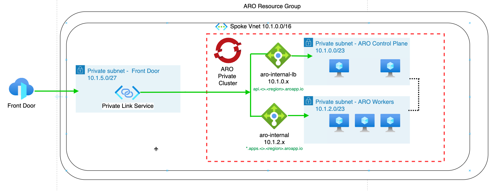

# Lab 3 - Azure Front Door Integration with Azure Red Hat OpenShift (ARO)

### Estimated Duration: 30 minutes

In this lab, you'll learn how to expose applications running on an Azure Red Hat OpenShift (ARO) cluster using Azure Front Door.

## Overview

Azure Front Door is a global, scalable entry-point that uses the Microsoft global edge network to create fast, secure, and highly scalable web applications. When integrated with ARO, it provides several benefits:

* **Enhanced Security**: WAF and DDoS protection, certificate management, and SSL offloading
* **Global Edge Access**: Traffic is controlled at Microsoft's edge before entering your Azure environment
* **Private Infrastructure**: Your ARO cluster and Azure resources can remain private even when services are publicly accessible

## Architecture



In this architecture:
- Azure Front Door sits at the edge of Microsoft's network
- Traffic is routed through Azure Front Door to your ARO cluster
- For private clusters, Front Door connects via an Azure Private Link service
- For public clusters, Front Door can connect directly to public endpoints

## Prerequisites

- An Azure Red Hat OpenShift (ARO) cluster (public or private)
- Access to Azure CLI and OpenShift CLI (oc)
- A deployed application on the ARO cluster (like the microsweeper app from the workshop deployed in the previous lab)
- Administrative access to your Azure subscription

## Lab Objectives

You will be able to complete the following tasks:

- Task 1: Environment Variables Setup
- Task 2: Set Up Azure Front Door
  - Task 2.1: Create an Azure Front Door Profile
  - Task 2.2: Configure Origin Group and Origin
  - Task 2.3: Create Default Route
- Task 3: Test the Configuration

## Task 1: Environment Variables Setup

Before starting with Azure Front Door deployment, we need to set up the necessary environment variables. These variables will be used throughout the implementation process.

**IMPORTANT NOTE:** First, copy and paste the environment variables into a Notepad. Then, define the values before exporting them in Cloud Shell.

- **AZ_USER** - Define your user ID
- **AZ_RG** - Resource group name where the ARO Cluster is deployed
- **AZ_ARO** - Your ARO Cluster's unique name. Replace the CLUSTER_NAME with your actual ARO cluster name
- **AZ_LOCATION** - Resource group region of your ARO cluster

### Core Environment Variables

```bash
# Set these variables according to your environment
export AZ_USER="odluser<UNIQUE-VALUE>"    # Define your user ID        
export AZ_RG="openshift"    # Resource group name where the ARO Cluster is deployed                
export AZ_ARO="$(az aro show --name <CLUSTER_NAME> --resource-group openshift --query "apiserverProfile.url" --output tsv | sed -E 's|https://api\.([^.]+)\..*|\1|')"    # Your ARO Cluster's unique name. Replace the CLUSTER_NAME with your actual ARO cluster name
export AZ_LOCATION="RG_REGION"    # Resource group region of your ARO cluster                 
export UNIQUE="$(openssl rand -hex 4)"      
export ARO_DEFAULT_DOMAIN="${AZ_ARO}.${AZ_LOCATION}.aroapp.io"
export PUBLIC_ROUTE_HOST="microsweeper-appservice-microsweeper-ex.apps.${ARO_DEFAULT_DOMAIN}"
export FRONTDOOR_NAME="${AZ_USER}-frontdoor"
export ENDPOINT_NAME="${AZ_USER}-endpoint"
export ORIGIN_GROUP="${AZ_USER}-origins"

# OpenShift variables
export NAMESPACE="microsweeper-ex"             
export APP_SERVICE="microsweeper-appservice" 
```

## Task 2: Set Up Azure Front Door

### Task 2.1: Create an Azure Front Door Profile

In this task, you will create a Front Door profile to manage your global routing configuration.

1. Create the Azure Front Door service.

   ```bash
   az afd profile create \
      --profile-name "$FRONTDOOR_NAME" \
      --resource-group "$AZ_RG" \
      --sku Standard_AzureFrontDoor
   ```

1. Create the endpoint.

   ```
   az afd endpoint create \
      --endpoint-name "$ENDPOINT_NAME" \
      --profile-name "$FRONTDOOR_NAME" \
      --resource-group "$AZ_RG" \
      --enabled-state Enabled
   ```

1. Get the endpoint hostname.

   ```
   export DEFAULT_ENDPOINT_HOST=$(az afd endpoint show \
      --endpoint-name "$ENDPOINT_NAME" \
      --profile-name "$FRONTDOOR_NAME" \
      --resource-group "$AZ_RG" \
      --query hostName -o tsv)
   ```

### Task 2.2: Configure Origin Group and Origin

In this task, you will set up an origin group and define the backend origin that Azure Front Door will route traffic to.

1. Create the origin group.

   ```bash
   az afd origin-group create \
      --origin-group-name "$ORIGIN_GROUP" \
      --profile-name "$FRONTDOOR_NAME" \
      --resource-group "$AZ_RG" \
      --probe-request-type GET \
      --probe-protocol Http \
      --probe-path "/" \
      --probe-interval-in-seconds 30 \
      --sample-size 4 \
      --successful-samples-required 3 \
      --additional-latency-in-milliseconds 50
   ```

1. Create the origin.

   ```
   az afd origin create \
      --origin-name "aro-app-origin" \
      --origin-group-name "$ORIGIN_GROUP" \
      --profile-name "$FRONTDOOR_NAME" \
      --resource-group "$AZ_RG" \
      --host-name "$PUBLIC_ROUTE_HOST" \
      --origin-host-header "$PUBLIC_ROUTE_HOST" \
      --http-port 80 \
      --https-port 443 \
      --priority 1 \
      --weight 1000 \
      --enabled-state Enabled
   ```

1. Display the origin information.

   ```
   az afd origin show \
      --origin-name "aro-app-origin" \
      --origin-group-name "$ORIGIN_GROUP" \
      --profile-name "$FRONTDOOR_NAME" \
      --resource-group "$AZ_RG" \
      --output table
   ```

### Task 2.3: Create Default Route

In this task, you will create a default route to link your frontend endpoint with the backend origin group.

1. Create a route with the default endpoint domain.

   ```bash
   az afd route create \
      --route-name aro-app-route \
      --profile-name "$FRONTDOOR_NAME" \
      --resource-group "$AZ_RG" \
      --endpoint-name "$ENDPOINT_NAME" \
      --origin-group "$ORIGIN_GROUP" \
      --https-redirect disabled \
      --forwarding-protocol MatchRequest \
      --supported-protocols Http Https \
      --link-to-default-domain Enabled \
      --patterns "/*"
   ```

1. Display the route information.

   ```
   az afd route show \
      --route-name aro-app-route \
      --profile-name "$FRONTDOOR_NAME" \
      --endpoint-name "$ENDPOINT_NAME" \
      --resource-group "$AZ_RG" \
      --output table
   ```

## Task 3: Test the Configuration

In this task, you will verify the Azure Front Door setup by accessing the application through its frontend URL.

1. Run the below command to fetch the Azure front door endpoint and access it through the web browser to view the application. Access the web application using `HTTP/8080` port.

   ```bash
   echo $DEFAULT_ENDPOINT_HOST
   ```

1. When visiting your custom domain in a browser, you should see:

   - A HTTP connection
   - Your application loading successfully
   - Traffic routed through Azure Front Door

## Benefits of This Approach

- **Security**: Azure Front Door provides WAF capabilities to protect against common web exploits
- **Performance**: Global content delivery and edge caching improve application performance
- **Scalability**: Front Door automatically scales with traffic demands
- **Traffic Management**: Load balancing and health probes ensure high availability

## Additional Resources

- [Azure Front Door Documentation](https://learn.microsoft.com/en-us/azure/frontdoor/)
- [ARO Documentation](https://learn.microsoft.com/en-us/azure/openshift/)
- [OpenShift Networking Documentation](https://docs.openshift.com/container-platform/latest/networking/understanding-networking.html)

## Review

In this lab, you completed the following tasks:

- Setup the environment variables
- Set Up Azure Front Door
- Tested the Azure Front Door configuration

### You have successfully completed the lab.
