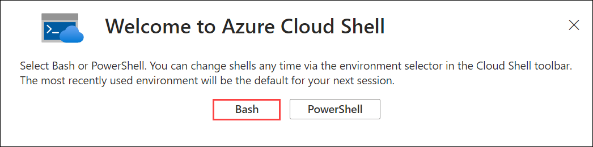
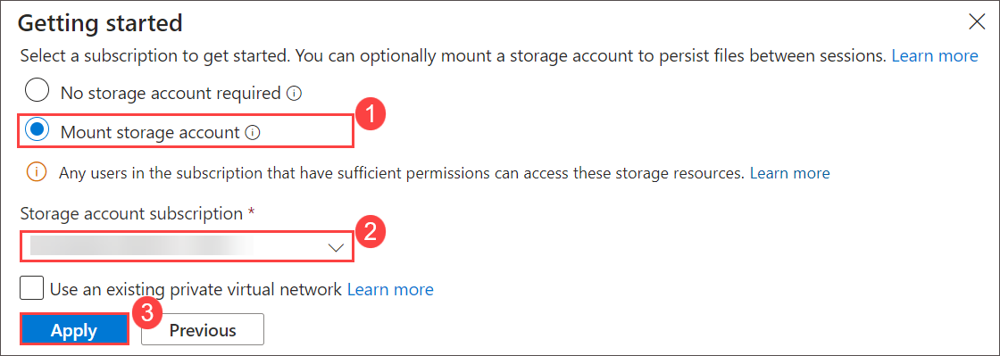
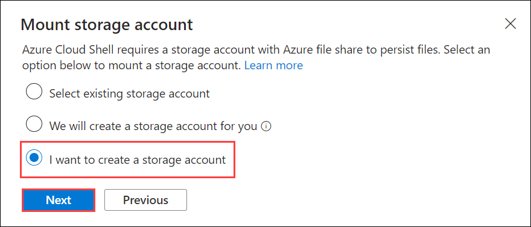
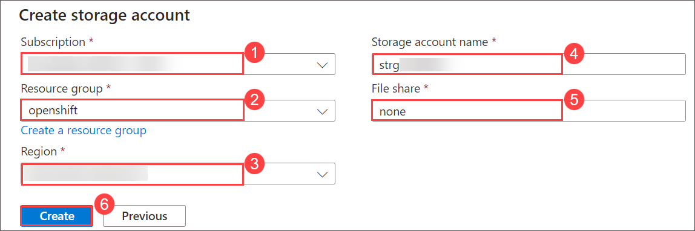
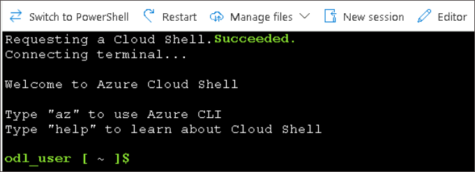

# Prerequisites

## Setup Azure Cloud Shell

You can use the Azure Cloud Shell accessible at <https://shell.azure.com> once you login with an Azure subscription.

Head over to <https://shell.azure.com> and sign in with your Azure Subscription details.

1. Select **Bash** as your shell.

   

1. Select **Mount storage account**, your default **Subscription** and click **Apply**.

   

1. Select **I want to create a storage account** and click **Next**.

   

1. Specify then following values and click **Create (6)** to create a new storage account.

   - Subscription: **Select your default subscription (1)**
   - Resource group: **openshift (2)**
   - Region: **<inject key="Region" enableCopy="false"/> (3)**
   - Storage account name: **strg<inject key="Deployment ID" enableCopy="false"/> (4)**
   - File share: **none (5)**

   

1. You should now have access to the Azure Cloud Shell.

   

<validation step="e4da372d-001a-4680-ba58-23f917916623" />

## Install OpenShift CLI (oc)

You'll need to download the **latest OpenShift CLI (oc)** client tools for OpenShift 4. You can follow the steps below on the Azure Cloud Shell.

Please run following commands on Azure Cloud Shell to download and setup the OpenShift client.

```sh
cd ~
curl https://mirror.openshift.com/pub/openshift-v4/clients/ocp/latest/openshift-client-linux.tar.gz > openshift-client-linux.tar.gz

mkdir openshift

tar -zxvf openshift-client-linux.tar.gz -C openshift

echo 'export PATH=$PATH:~/openshift' >> ~/.bashrc && source ~/.bashrc

```

The OpenShift CLI (oc) is now installed.

In case you want to work from your own operating system, here are the links to the different versions of CLI:

- https://mirror.openshift.com/pub/openshift-v4/clients/ocp/latest/openshift-client-windows.zip
- https://mirror.openshift.com/pub/openshift-v4/clients/ocp/latest/openshift-client-linux.tar.gz
- https://mirror.openshift.com/pub/openshift-v4/clients/ocp/latest/openshift-client-mac.tar.gz

## GitHub Account

You'll need a personal GitHub account. You can sign up for free [here](https://github.com/join).

## You are all setup with the prerequisites!
